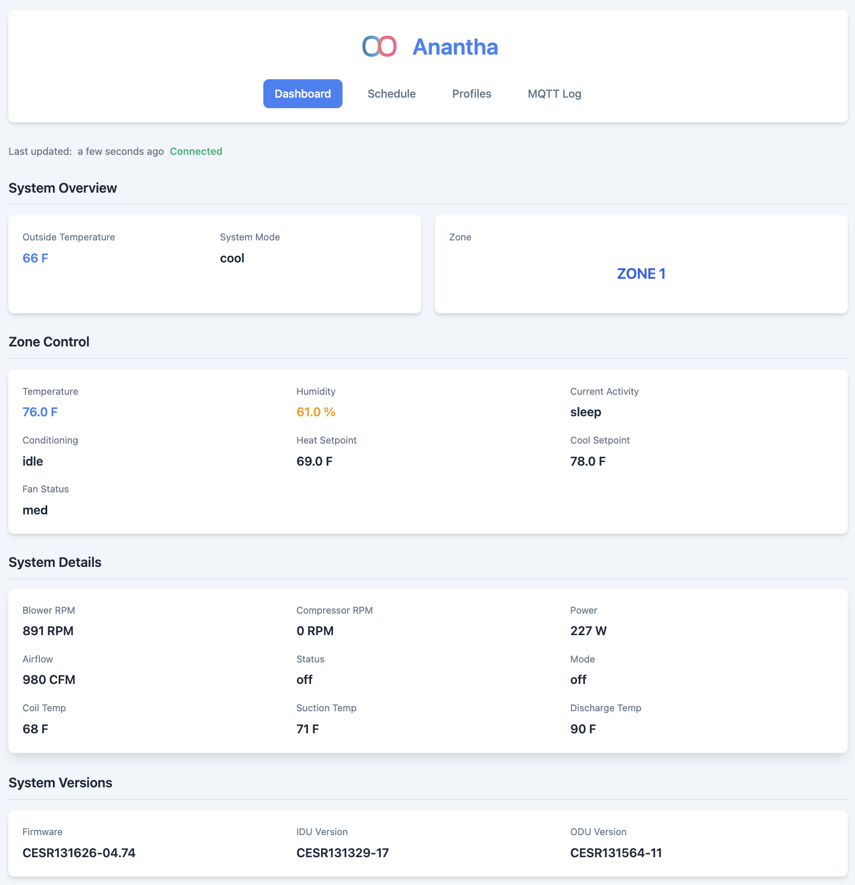

# Anantha - Local Control Toolkit for Carrier Thermostats

Anantha enables local control of Carrier Infinity thermostats by intercepting DNS requests and redirecting HTTP/MQTT connections. It provides a web dashboard and Home Assistant integration for thermostat control.

## About the Name

Anantha (അനന്ത) is a Malayalam word meaning "infinite".

> ⚠️ **WARNING**: Using Anantha requires modifying your thermostat's firmware which will likely void your warranty. Improper use of your thermostat/HVAC may cause its destruction or lead to property damage. Use at your own risk. Anantha is not affiliated with Carrier and assumes no responsibility for any issues that may arise.

> ⚠️ **WARNING**: Installing this modified *will* disable your thermostat from communicating directly with Carrier's APIs. This means you will not be able to use the Carrier mobile app or web interface to control your thermostat. DO NOT install this firmware if you want to use the Carrier mobile app.

This project was inspired by [Infinitude](https://github.com/nebulous/infinitude) and supports the MQTT-based protocol used since firmware version v4.17.

## Prerequisites

1. Go programming language - Install from [golang.org/dl](http://golang.org/dl)
2. Your thermostat's firmware file (downloaded from [Carrier Infinity Thermostat Firmware page](https://www.myinfinitytouch.carrier.com/Infinity/Downloads))
3. Your Thermostat Device Serial ID (See "Service" -> "Model/Serial Numbers" -> "System Control" -> "Serial Number" in the thermostat's web interface - usually of the form "4123X123456")

## Installation

Install the anantha CLI tool:
```bash
go install github.com/anupcshan/anantha/cmd/anantha@latest
```

This installs a single binary `anantha` in your `$GOBIN` (typically `$HOME/go/bin`) with two main subcommands:
- `anantha serve`: The main server handling HTTP/MQTT communication
- `anantha edit-firmware`: A tool for patching firmware with the CA certificate

## Setup Instructions

### 1. Patch and Update Firmware

1. Download your thermostat's firmware (e.g., `BINF0456.hex`)
2. Patch the firmware:
   ```bash
   anantha edit-firmware -in original/BINF0456.hex -out updated/BINF0456.hex
   ```
3. Copy `updated/BINF0456.hex` to an SD card and flash it to your thermostat

### 2. Run Anantha Server

```bash
anantha serve \
  --ntp-addr <NTP_IP> \                           # NTP server IP (e.g., 192.168.86.1)
  --ha-mqtt-addr <HA_MQTT_IP> \                   # Home Assistant MQTT server IP
  --ha-mqtt-topic-prefix <HA_MQTT_TOPIC_PREFIX> \ # e.g., hvac/carrier
  --ha-mqtt-username <HA_MQTT_USERNAME> \         # Home Assistant MQTT username
  --ha-mqtt-password <HA_MQTT_PASSWORD> \         # Home Assistant MQTT password
  --client-id <THERMOSTAT_DEVICE_ID>              # Your Thermostat Serial ID
```

### 3. Configure Thermostat

Set your thermostat's DNS Server to Anantha's IP address.

## Features

- DNS server (port 53) for Carrier hostname resolution
- MQTT broker (port 8883) for thermostat communication
- HTTP server (ports 80, 443) for firmware updates and requests
- Web dashboard (port 26268 - spells "ANANT" on a phone keypad) for debugging
- Home Assistant integration with auto-discovery for controlling the thermostat
- Optional MQTT proxying to AWS IoT (requires additional setup)

## Debugging

Access the (read-only) web dashboard:
- Status page: `http://<ANANTHA_IP>:26268`
- Recent updates log: `http://<ANANTHA_IP>:26268/recent`



## Compatibility

Known working devices and firmware versions:

| Manufacturer | Model | Firmware Version |
|-------------|-------|------------------|
| Carrier | SYSTXCCITC01-B | v4.47 |
| Carrier | SYSTXCCITC01-B | v4.56 |

## Technical Details

Since firmware v4.17, Carrier thermostats use AWS IoT for MQTT communication. Unfortunately, AWS IoT client libraries pin a small list of valid CA certificates. The firmware modification replaces an existing trusted CA certificate with Anantha's CA certificate, enabling MQTT traffic interception. The generated CA certificate matches the checksum of the replaced certificate. This approach was chosen because modifying firmware checksums proved challenging.

For sparse details about the certificate generation process, see the `cmd/cagen` directory.

For a barebones proto definition of the communication over MQTT, see protobuf definitions in the `proto` directory.
